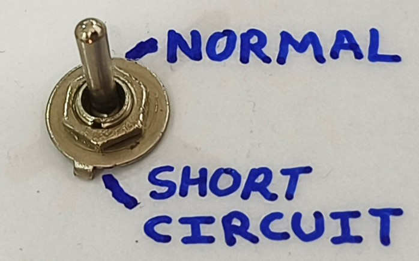
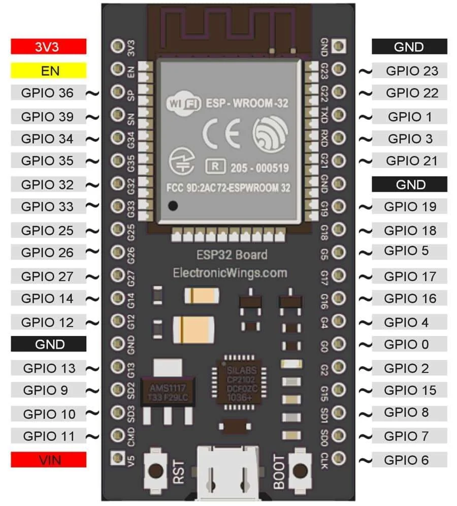
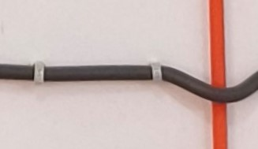
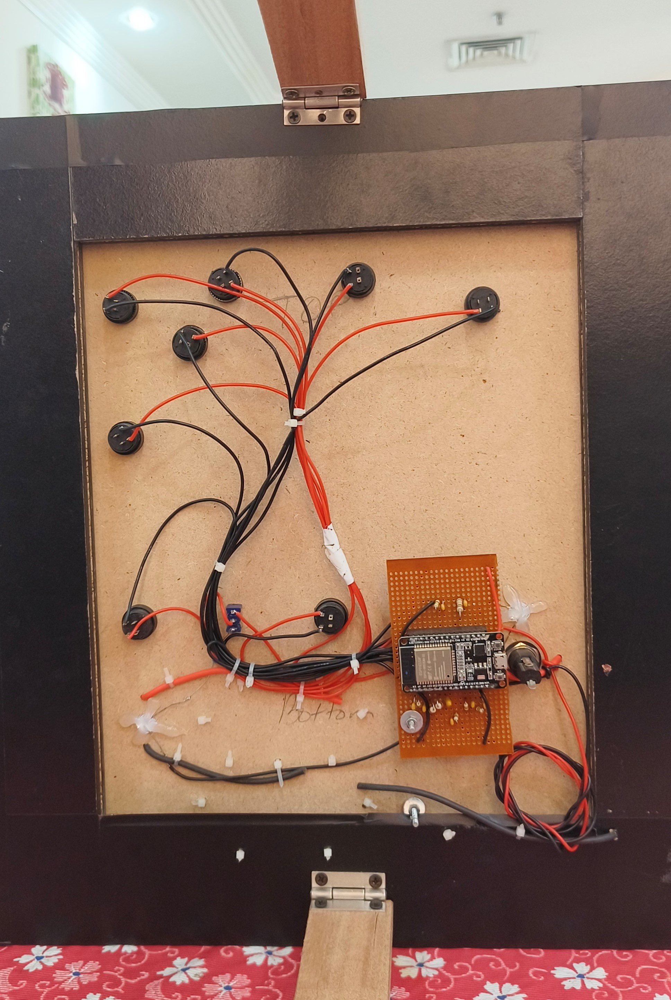

# Components

[⬆️ Back to README](../README.md)
<table>
<tr>

<td width="16.6666666667%" align="center" valign="middle">

Step down transformer

</td>

<td width="16.6666666667%" align="center" valign="middle">

</td>

<td width="16.6666666667%" align="center" valign="middle">

Rectifier diode

</td>

<td width="16.6666666667%" align="center" valign="middle">

</td>

<td width="16.6666666667%" align="center" valign="middle">

Fuse

</td>

<td width="16.6666666667%" align="center" valign="middle">

</td>

</tr>

<tr>

<td width="16.6666666667%" align="center" valign="middle">

LED

</td>

<td width="16.6666666667%" align="center" valign="middle">

</td>

<td width="16.6666666667%" align="center" valign="middle">

Push buttons

</td>

<td width="16.6666666667%" align="center" valign="middle">

</td>

<td width="16.6666666667%" align="center" valign="middle">

2-way switch

</td>

<td width="16.6666666667%" align="center" valign="middle">

</td>

</tr>

<tr>

<td width="16.6666666667%" align="center" valign="middle">

ESP-32 Microcontroller

</td>

<td width="16.6666666667%" align="center" valign="middle">

</td>

<td width="16.6666666667%" align="center" valign="middle">

Electrical wire

</td>

<td width="16.6666666667%" align="center" valign="middle">

</td>

<td width="16.6666666667%" align="center" valign="middle">

Wooden board

</td>

<td width="16.6666666667%" align="center" valign="middle">

</td>

</tr>

</table>

