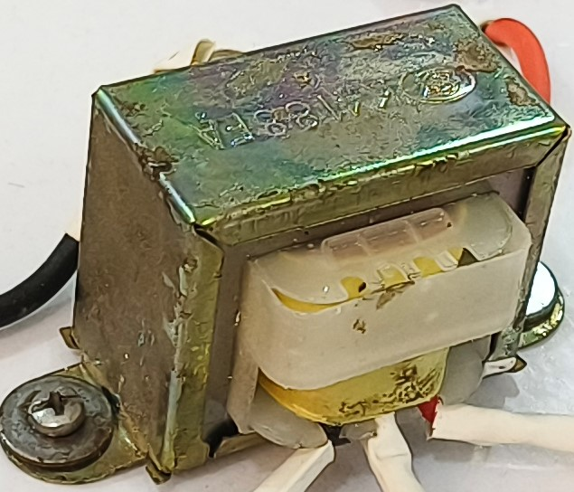
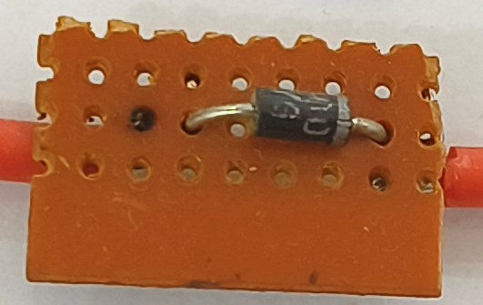
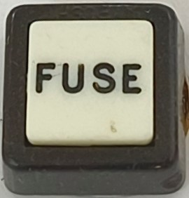
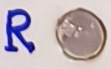

# Components

[⬆️ Back to README](../README.md)
<table>
<tr>

<td width="16.6666666667%" valign="middle">

- Step down transformer

</td>

<td width="16.6666666667%" align="center" valign="middle">

</td>

<td width="16.6666666667%" valign="middle">

- Rectifier diode

</td>

<td width="16.6666666667%" align="center" valign="middle">

</td>

<td width="16.6666666667%" valign="middle">

- Fuse

</td>

<td width="16.6666666667%" align="center" valign="middle">

</td>

<td width="16.6666666667%" valign="middle">

- LED

</td>

<td width="16.6666666667 align="center" valign="middle">

</td>

</tr>

<tr>

<td width="16.6666666667%" valign="middle">

- Fuse

</td>

<td width="16.6666666667%" align="center" valign="middle">

</td>

<td width="16.6666666667%" valign="middle">

- LED

</td>

<td width="16.6666666667 align="center" valign="middle">

</td>

<tr>

<td width="16.6666666667%" valign="middle">

- Step down transformer

</td>

<td width="16.6666666667%" align="center" valign="middle">

</td>

<td width="16.6666666667%" valign="middle">

- Rectifier diode

</td>

<td width="16.6666666667%" align="center" valign="middle">

</td>

</tr>
</table>

