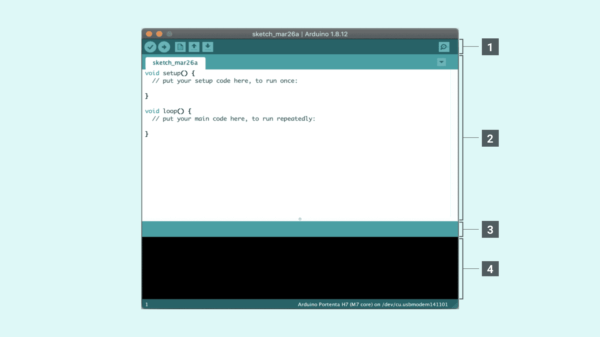
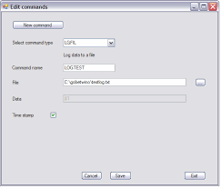
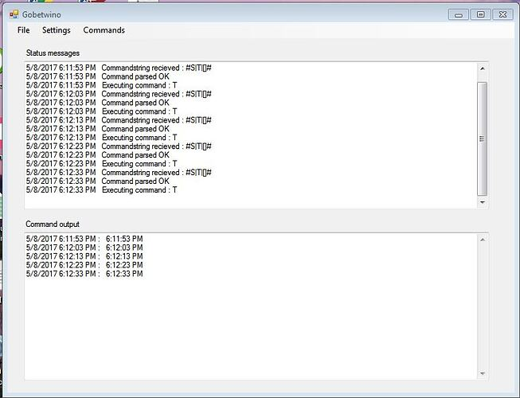

# Software

- [Code] (../Docs/Code.txt)

System Requirements: - Laptop/PC with MS Windows OS, MS-Power point, Arduino IDE, GOBETWINO.

[⬆️ Back to README](../README.md)

- Code required for reading the push button status and activating corresponding action on the PC is written on the Arduino IDE and transferred to ESP-32 by the USB link cable.

[⬆️ Back to README](../README.md)

- Settings for initiation of desired PC application are accomplished on the GOBETWINO settings window.
  

[⬆️ Back to README](../README.md)

- Commence and establish connection between CITS Trainer & GOBETWINO application on PC by the USB link.

[⬆️ Back to README](../README.md)
