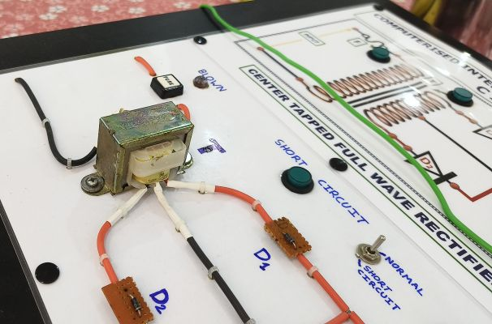
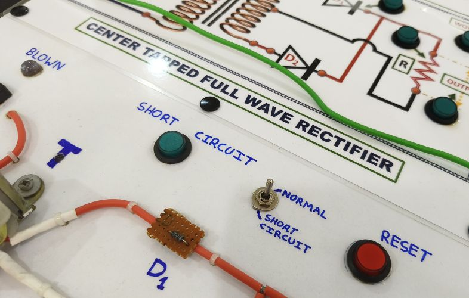
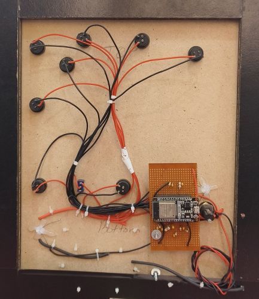
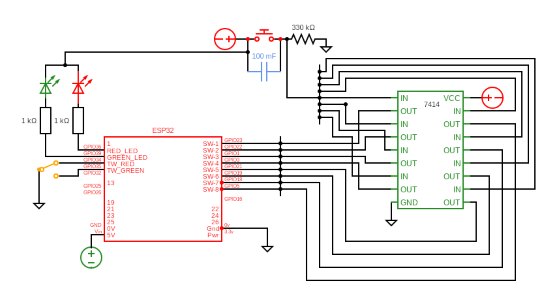
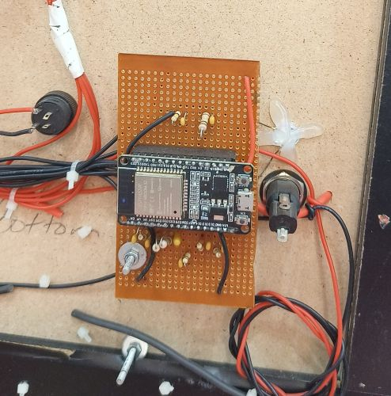
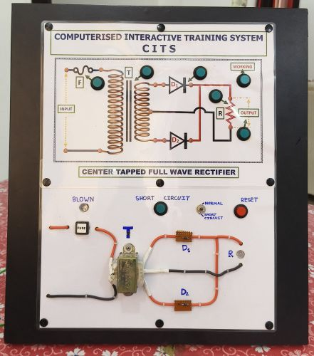

# Construction

- Prepare a wooden board, trainer laminated face plate printout and stick them together.

- Make holes for push buttons and install them.

[⬆️ Back to README](../README.md)

  
- Install the components for the full wave rectifier and interconnect them by soldering as required.

- Construct the debounce ckt for buttons i.a.w circuit diagram on common PCB.

- Solder the female header for the ESP32.

- Connect push buttons, LEDs and Switches to the ESP32 GPIOs as in the diagram & sketch.

[⬆️ Back to README](../README.md)
