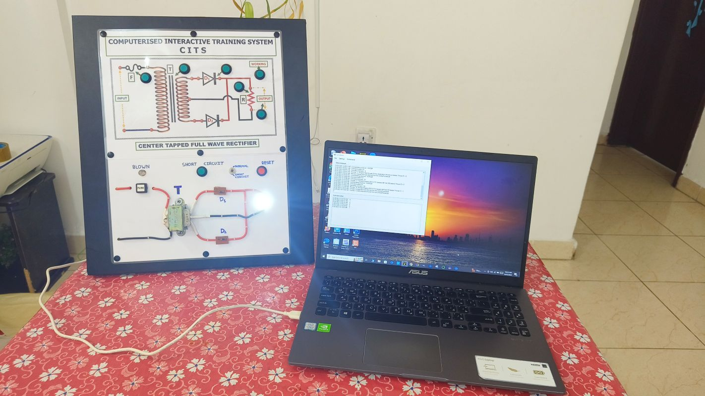

[⬆️ Back to README](../README.md)

# 1.Setting Up

- a. Connect laptop and CITS trainer using the USB cable.
- b. Red LED marked (R) turns ON indicating power available to CITS trainer.
- c. Initiate GOBETWINO application on the laptop.
- d. Verify relevant COM port connected display available on the GOBETWINO screen.

[⬆️ Back to README](../README.md)

# 2. Operation

<table>
<tr>

<td width="5%" align="center" valign="middle">

##### SL

</td>

<td width="30%" align="center" valign="middle">

###### Push Button

</td>

<td align="left" valign="middle">

###### Output effect on the laptop.

</td>

</tr>

<tr>

<td width="5%" align="center" valign="middle">

1

</td>

<td width="30%" align="center" valign="middle">

F (Fuse)

</td>

<td align="center" valign="middle">

Video file explaining fuse opens and runs. 

</td>
<tr>

<td width="5%" align="center" valign="middle">

2

</td>

<td width="30%" align="center" valign="middle">

T (Transformer)

</td>

<td align="left" valign="middle">

Webpage regarding stepdown transformer opens.

</td>

</tr>

 

[⬆️ Back to README](../README.md)
