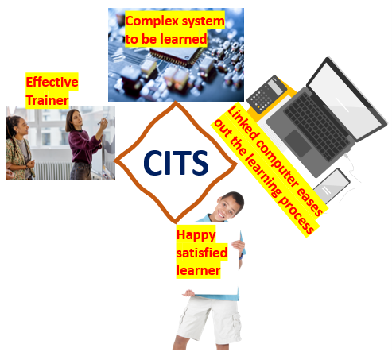

# EduTrain-using-ESP32
# 1. ESP32+Blynk_Home Automation

<table>
<tr>
<td width="50%" valign="top">

# This is an interactive training system for the center tapped full wave rectifier.

-  Training system gives an opportunity for the learner to: -
  - physically identify the components
  - electrical interconnection
  - real life working.
  - interact and initiate various contents viz. videos, PPTs, webpages, Chat GPT etc.
  - 
</td>

<td width="50%" align="center" valign="middle">

</td>
</tr>
</table>

# 2. About Project
An ESP32 is hardware integrated to several switches, coded and configured for learner interaction using GOBETWINO to a laptop/ desktop. 
- [1-Objectives](Docs/1-Objectives.md)
- [2-Components](Docs/2-Components.md)
- [3-Software](Docs/3-Software.md)
- [4-Construction](Docs/4-Construction.md)
- [5-Demonstration](Docs/5-Demonstration.md)
- [6-Conclusion](Docs/6-Conclusion.md)
- [7-Future](Docs/7-Future.md)

  
